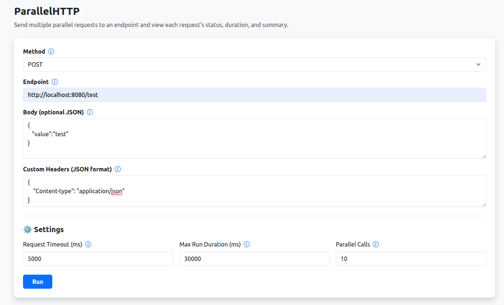
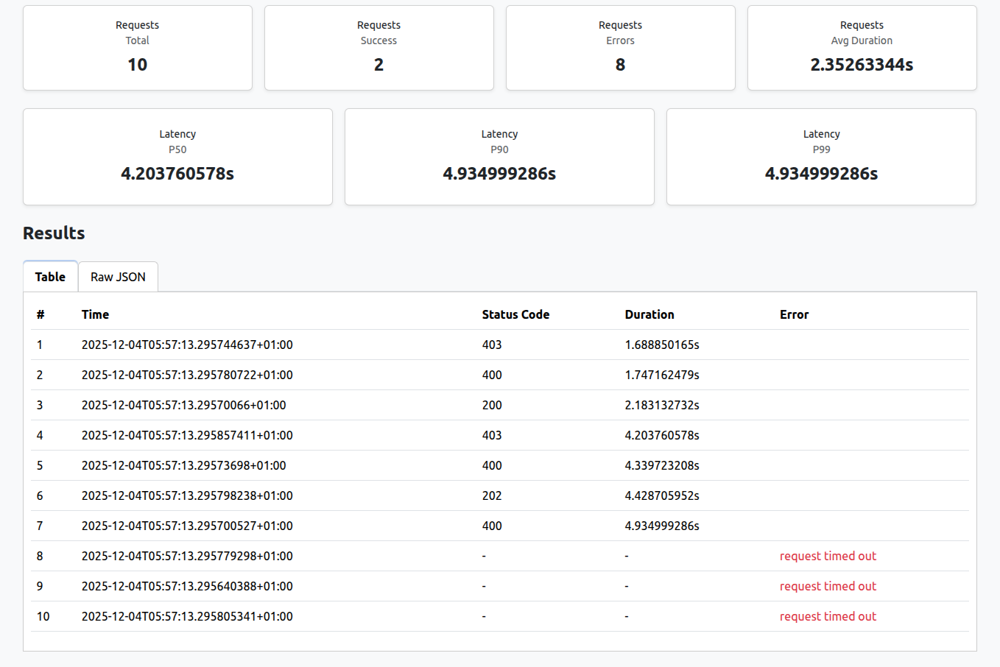

# 🚀 ParallelHTTP

A lightweight tool for testing APIs by sending multiple **parallel HTTP requests**.

It includes:

- 💻 **Web UI**  
- 🐳 **Docker image**  
- 💼 **CLI mode**  
- 🧩 **REST API endpoint**

---

## 🛠 Features

- Send multiple parallel HTTP requests  
- Configure method, endpoint, body, timeout  
- Track response time & status  
- Aggregated summary: success/error, avg latency  
- Export responses to CSV  
- Web UI for interactive testing  
- CLI for quick terminal runs  

---

## ⚠️ Disclaimer

This tool is intended **only for testing APIs, servers, and domains that you own or have explicit permission to test**.  
Running parallel or high-volume requests against systems without authorization may violate:

- Terms of Service  
- Local or international laws  
- Computer misuse or anti-fraud regulations  
- Responsible use and security policies  

> [!IMPORTANT]  
> By using this tool, **you agree that you are solely responsible for ensuring you have proper authorization** to test the target systems.  
> The authors and contributors of this project assume **no liability** for any misuse, damage, or legal consequences resulting from unauthorized or unethical use.
>
> **Use responsibly. Test only what you own.**

---

## 📦 Installation

You can use ParallelHTTP via **binary**, **Docker**, **Web UI**, or **CLI**.

### 1️⃣ Install Using Binaries (Recommended)

Download the latest release from:  
👉 [**GitHub Releases**](https://github.com/nicumicle/parallelhttp/releases)

Run:

```bash
./parallelhttp --help
```

### 2️⃣ Install From Source

```bash
git clone https://github.com/nicumicle/parallelhttp.git
cd parallelhttp
```

## 🖥️ Web UI

### ▶️ Option A — Run the UI with Docker

```shell
docker run --rm -p 8080:8080 -it nicumicle/parallelhttp
```

Open in browser:
👉 [http://localhost:8080](http://localhost:8080)

### ▶️ Option B — Run the UI from Go

```shell
go run cmd/service/main.go
```

This service also provides a testing endpoint:

Test endpoint (returns random responses)
👉 [http://localhost:8080/test](http://localhost:8080/test)

### 📷 Screenshots



Results:



## 💼 CLI Usage

You can run the CLI using the binary or from source.

### ▶️ Option A — CLI Binary

```shell
./parallelhttp --help
```

### ▶️ Option B — Run CLI from Source

```shell
go run cmd/cli/main.go --help
```

```
CLI Flags
  -duration duration    Max duration for all calls. 0 = no limit
  -endpoint string      Required. Target URL
  -format string        text | yaml | json (default: json)
  -method string        GET POST PUT PATCH DELETE (default: GET)
  -parallel int         Number of parallel requests (default: 1)
  -timeout duration     Request timeout (default: 10s)
```

Example

```shell
go run cmd/cli/main.go \
  --endpoint=http://localhost:8080/test \
  --parallel=5 \
  --method=GET \
  --timeout=2s \
  --duration=10s \
  --format=json
```

Output:

```json
{
  "requests": [
    {
      "response": {
        "status_code": 200,
        "time": "2025-12-02T04:39:26.450811405+01:00",
        "duration": 176680135,
        "duration_h": "176.680135ms"
      },
      "error": null,
      "error_message": null
    },
    {
      "response": {
        "status_code": 200,
        "time": "2025-12-02T04:39:26.450838753+01:00",
        "duration": 177105875,
        "duration_h": "177.105875ms"
      },
      "error": null,
      "error_message": null
    },
    {
      "response": {
        "status_code": 200,
        "time": "2025-12-02T04:39:26.450989804+01:00",
        "duration": 176999320,
        "duration_h": "176.99932ms"
      },
      "error": null,
      "error_message": null
    },
    {
      "response": {
        "status_code": 200,
        "time": "2025-12-02T04:39:26.450761076+01:00",
        "duration": 177158817,
        "duration_h": "177.158817ms"
      },
      "error": null,
      "error_message": null
    },
    {
      "response": {
        "status_code": 200,
        "time": "2025-12-02T04:39:26.450879196+01:00",
        "duration": 179940733,
        "duration_h": "179.940733ms"
      },
      "error": null,
      "error_message": null
    }
  ],
  "stats": {
    "start_time": "2025-12-02T04:39:26.450727731+01:00",
    "end_time": "2025-12-02T04:39:26.630824982+01:00",
    "duration": "180.097251ms",
    "latency": {
      "p50": "177.105875ms",
      "p90": "179.940733ms",
      "p99": "179.940733ms"
    }
  }
}
```

## 🧩 REST Endpoint

When running the UI service:

```shell
curl http://localhost:8080/test
```

## 🧡 Credits

Built with [Go](https://go.dev/), [Bootstrap](https://getbootstrap.com/), and curiosity.


## 📝 License

Licensed under the MIT License.
See the full license here: [LICENSE](./LICENSE)

## ⭐ Support

If you like this project, give it a ⭐ and share it with your friends!
