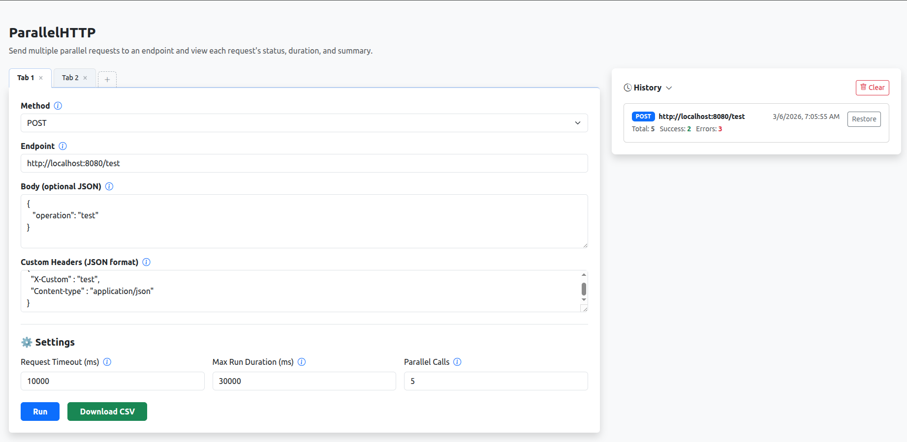
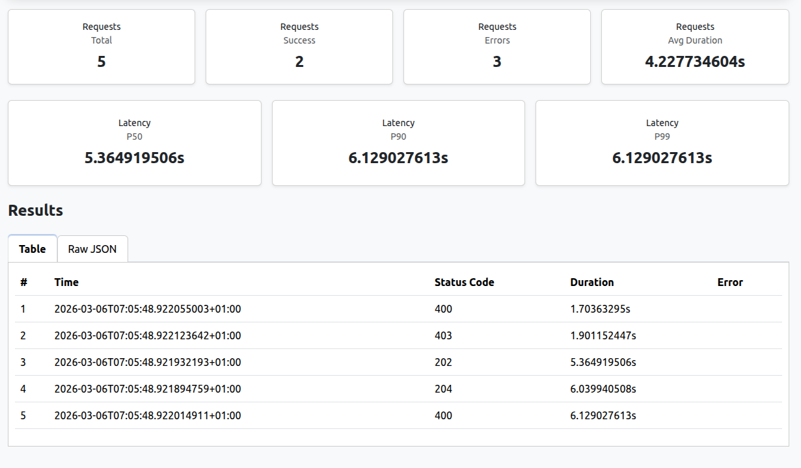

<div align="center">

# ParallelHTTP

**Send parallel HTTP requests. Measure latency. Stress-test your APIs.**

[](https://go.dev)
[](https://hub.docker.com/r/nicumicle/parallelhttp)
[](https://github.com/nicumicle/parallelhttp/releases)
[](./LICENSE)



</div>

---

## Overview

ParallelHTTP is a lightweight, zero-dependency tool for load testing and benchmarking HTTP APIs. Configure the number of concurrent requests, method, timeout, and duration — then get back structured results with latency percentiles and per-request status codes.

It ships as a single binary, a Docker image, and a Web UI — so you can use whichever fits your workflow.

---

## Features

| | |
|---|---|
| Parallel requests | Fire N requests simultaneously and collect every response |
| Latency percentiles | P50, P90, P99 aggregated across all requests |
| Multiple output formats | `json`, `yaml`, or `text` |
| Web UI | Visual interface for interactive testing in the browser |
| CLI | Scriptable, CI-friendly terminal usage |
| CSV export | Download results directly from the Web UI |
| Test endpoint | Built-in endpoint that returns random responses for trying things out |

---

## Quick Start

The fastest way to get up and running:

```bash
# Run the Web UI with Docker — no installation needed
docker run --rm -p 8080:8080 nicumicle/parallelhttp
```

Then open [http://localhost:8080](http://localhost:8080) in your browser.

---

## Installation

### Binary (Recommended)

Download the pre-built binary for your OS from the [Releases page](https://github.com/nicumicle/parallelhttp/releases).

**macOS / Linux:**
```bash
# Make it executable
chmod +x parallelhttp

# Confirm it works
./parallelhttp --help
```

**Windows:**

Download `parallelhttp.exe` and run it from Command Prompt or PowerShell:
```powershell
.\parallelhttp.exe --help
```

---

### Docker

```bash
docker run --rm -p 8080:8080 nicumicle/parallelhttp
```

---

### Build from Source

Requires [Go 1.24+](https://go.dev/dl/).

```bash
git clone https://github.com/nicumicle/parallelhttp.git
cd parallelhttp

# Build the binary
go build -o parallelhttp ./cmd/cli/main.go
```

---

## Usage

### Web UI

Start the server using any of the following methods:

```bash
# Using the binary
./parallelhttp --serve --port=8080

# Using Docker
docker run --rm -p 8080:8080 nicumicle/parallelhttp

# From source
go run cmd/service/main.go
```

Open [http://localhost:8080](http://localhost:8080) in your browser.

**Results:**



---

### CLI

Run parallel requests directly from your terminal.

```bash
./parallelhttp \
  --endpoint=https://api.example.com/health \
  --parallel=10 \
  --method=GET \
  --timeout=2s \
  --duration=30s \
  --format=json
```

**Flags:**

| Flag | Required | Description | Default |
|------|----------|-------------|---------|
| `--endpoint` | Yes | Target URL | — |
| `--parallel` | No | Number of concurrent requests | `1` |
| `--method` | No | HTTP method: `GET` `POST` `PUT` `PATCH` `DELETE` | `GET` |
| `--timeout` | No | Per-request timeout (e.g. `500ms`, `2s`) | `10s` |
| `--duration` | No | Total run duration (e.g. `30s`, `5m`). `0` = unlimited | `0` |
| `--format` | No | Output format: `json` `yaml` `text` | `json` |
| `--serve` | No | Start the Web UI server | — |
| `--port` | No | Web UI server port | `8080` |

**Example output (`--format=json`):**

```json
{
  "requests": [
    {
      "response": {
        "status_code": 200,
        "time": "2025-12-02T04:39:26.450811Z",
        "duration": 176680135,
        "duration_h": "176.68ms"
      },
      "error": null,
      "error_message": null
    }
  ],
  "stats": {
    "start_time": "2025-12-02T04:39:26.450727Z",
    "end_time": "2025-12-02T04:39:26.630824Z",
    "duration": "180.09ms",
    "latency": {
      "p50": "177.10ms",
      "p90": "179.94ms",
      "p99": "179.94ms"
    }
  }
}
```

---

### REST API

When the server is running, a built-in test endpoint is available that returns random HTTP responses. It is useful for verifying your setup before pointing the tool at a real API.

```bash
curl http://localhost:8080/test
```

---

## Responsible Use

> [!IMPORTANT]
> ParallelHTTP is intended **only for testing APIs, servers, and domains you own or have explicit permission to test.**
>
> Sending high-volume requests to systems without authorization may violate terms of service, computer misuse laws, or security policies. **The authors assume no liability for any misuse.**
>
> Test only what you own.

---

## Contributing

Contributions are welcome. Please open an issue to discuss significant changes before submitting a pull request.

---

## License

MIT — see [LICENSE](./LICENSE) for details.

---

<div align="center">

Built with [Go](https://go.dev/) and [Bootstrap](https://getbootstrap.com/).

If you find this useful, give it a ⭐

</div>
